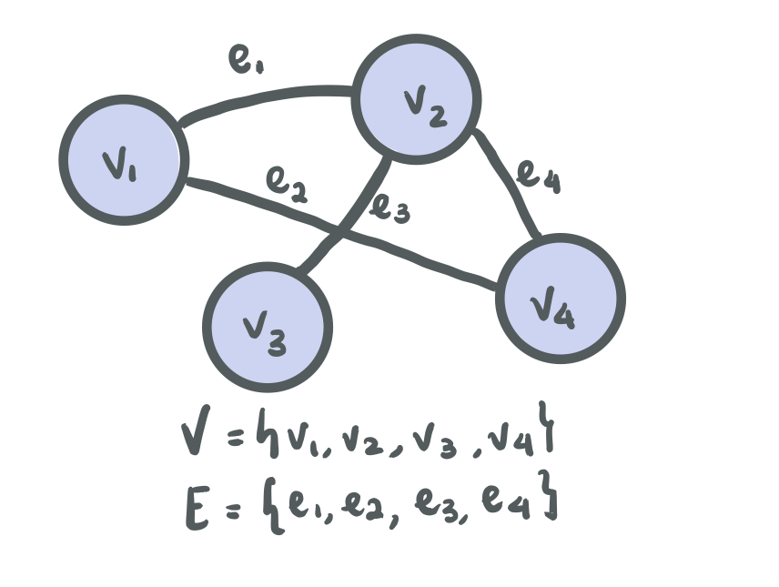
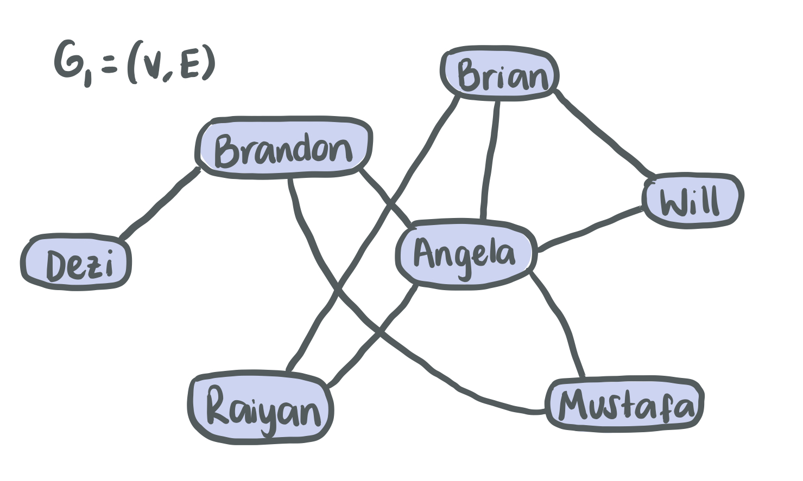
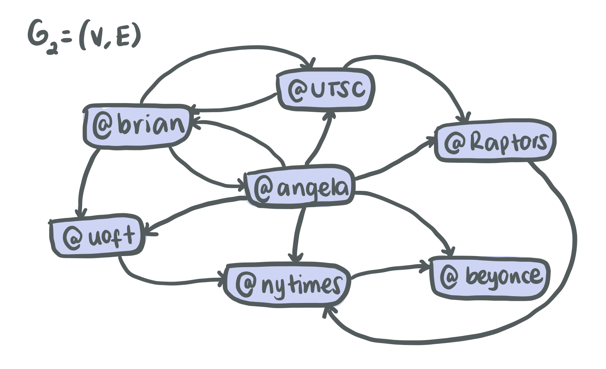

---

 <a href="https://youtu.be/"> Recorded videos (TBA) </a> 

---

# Graphs

Graphs are used as a model to represent the relationship between the representation of items and problem we need to solve. We are trying to find a different way to represent a problem and use tools to solve it.

---

# Definition of a Graph

Each graph **G = (V,E)** consists of:

- A set of **nodes** that represent data items. We call that set **V**.
- A set of **edges** that represent the connections (relationship) between nodes. We call that set **E**.

---

# Types of Graphs

There are two general types of graphs, **undirected** and **directed**

## Undirected graphs

Graphs with edges that represent direction in both ways, in other words, there is a reciprocal relationship.

_Example:_ Facebook's friend network

## Directed graphs

Graphs with edges that represent one side direction, in other words, there is a one way relationship.

_Example:_ Twitter's followers network

---

# Terms to remember

## Neighbours

For an undirected graph, a node **v** is a **neighbour** of the node **u** if there exists an edge between those two nodes (that edge is represented by **{u,v}**). 

_Example:_ In **G1**, the neighbour of Dezi is Brandon.

For a directed graph, a node **v** is a **in-neighbour** of the node **u** if there exists an edge **{u,v}** from **u** to **v**. A node **v** is a **out-neighbour** of the node **u** if there exists an edge **{v,u}** from **v** to **u**. 

_Example:_ In **G2**, @Raptors is an in-neighbour of @UTSC, and @UTSC is an out-neightbour of @Raptors.

## Neighbourhood

For an undirected graph, the **neighbourhood** of a node **v** is the set of all nodes that are neighbours of **v**.

_Example:_ In **G1**, the neighbourhood of Mustafa is the set of nodes {Brandon, Angela}.

For a directed graph, there exists an **out-neighbourhood** and an **in-neighbourhood**.

_Example:_ In **G2**, the in-neighbourhood of @Brian is the set of the nodes {@UTSC, @Uoft, @Angela} and the out-neighbourhood of @Brian is the set of the nodes {@UTSC, @Angela}

## Degree

For an undirected graph, the **degree** of a node **v** is the size (number of nodes) in the neighbourhood of **v**.

_Example:_ In **G1**, the degree of Will is 2.

For a directed graph, the node **v** has an **in-degree** and an **out-degree**.

_Example:_ In **G2**, the in-degree of @nytimes is 1 and the out-degree is 3.

## Path

A **path** is a sequence of consecutive nodes that can be visited by following exisiting edges between each pair of consevutive nodes.

## Cycle

For undirected graphs, a **cycle** is a path with at least three nodes that starts and ends at the same node.

_Example:_ In **G1**, there is a cycle between the nodes Brandon, Mustafa and Angela.

For directed graphs, a **cycle** is a path that begins and ends at the same node, but in this case the path can have any number of nodes.

_Example:_ In **G2**, there is a cycle between the nodes @Brian, @UTSC and @Angela.

### Exercise

Find the neighbourhood and degree of each node in **G1** and **G2**. Find all cycles in **G1** and **G2**.

---

# Representing Graphs

## Adjacency list

The **adjacency list** is an array of size _N_ with one entry per node, where _N_ is the number of nodes in the grpah. The _ith_ entry of the array contains a pointer to a linked list that stores the indexes of the nodes that _i_ is connected to (the neighbours of _i_).

## Adjacency matrix

The **adjacency matrix** is a 2D array of size _N_ x _N_, where _N_ is the number of nodes in the graph. For an undirected graph, the entry **A[i][j]** is 1 if nodes **i** and **j** are connected, and zero otherwise. For a directed graph, the entry **A[i][j]** is 1 if there is an edge from **i** to **j**, and zero otherwise.

### Exercise

Represent **G1** and **G2** using Adjacency lists and matrices.

---
